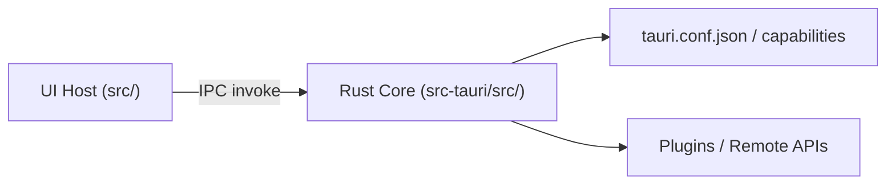

# Mirage Architecture

> Last Updated: 2026-04-17

本文件是 Mirage 的 Code Map。
目标是帮助贡献者快速回答两个问题：

- 我要改某个行为，应该先看哪块代码？
- 这个边界为什么这样设计，哪些约束不能随意破？

## Bird's Eye View

在最高层，Mirage 是一个 Tauri 应用：

- UI Host（Vue/TypeScript）负责交互与展示。
- Rust Core（Tauri backend）负责命令执行与运行时能力。
- 二者通过 IPC 交换命令与结果。



## Technology Stack

本节列举已确认的技术选型，仅做事实性枚举。约束定义见各权威文档。

### Frontend (`src/`)

| 技术　　　　　　　　　　　  | 角色　　　　　　　　　　 |
| --------------------------- | ------------------------ |
| Vue 3 + TypeScript　　　　  | 应用框架　　　　　　　　 |
| Vue Router 4　　　　　　　  | 客户端路由　　　　　　　 |
| Pinia + @tauri-store/pinia  | 状态管理 + Tauri 持久化  |
| TailwindCSS + shadcn-vue　  | 原子化样式 + 无头组件库  |
| VueUse　　　　　　　　　　  | 通用 composables　　　　 |
| Zod　　　　　　　　　　　　 | IPC 边界 schema 校验　　 |
| Vite 6　　　　　　　　　　  | 构建工具　　　　　　　　 |
| Vitest　　　　　　　　　　  | 单元测试　　　　　　　　 |
| ESLint + Prettier　　　　　 | 代码质量与格式化　　　　 |
| pnpm　　　　　　　　　　　  | 包管理　　　　　　　　　 |

### Backend (`src-tauri/src/`)

| 技术                             | 角色                           |
| -------------------------------- | ------------------------------ |
| Tauri 2                          | 应用外壳与跨平台能力           |
| SurrealDB 3.x 嵌入式 (SurrealKV) | 数据库                         |
| tokio (full)                     | 异步运行时                     |
| tracing + tracing-subscriber     | 结构化日志与可观测性           |
| reqwest                          | HTTP 客户端（LLM API 调用）    |
| anyhow + thiserror               | 错误处理                       |
| ring                             | 加密（Vault 数据加密，MVP）    |
| argon2（待引入）                 | 用户口令派生主密钥（后续特性） |
| validator                        | 输入校验                       |
| Specta                           | TypeScript 类型导出            |
| serde + serde_json               | 序列化                         |

## Code Map

这一节按真实目录组织。先定位，再深入。

### `src/` - UI Host

当前期规划结构（类型分组）：

```
src/
  main.ts              -- Vue 应用入口，挂载 Vue 应用
  App.vue              -- 根组件
  router/              -- Vue Router 配置与路由定义
  views/               -- 路由级页面组件（命名：XxxView.vue）
  components/          -- 可复用 UI 组件（可按功能区域建子目录）
  stores/              -- Pinia stores（命名：useXxxStore.ts，通过 @tauri-store/pinia 持久化）
  composables/         -- 状态逻辑提取（命名：useXxx.ts）
  services/            -- IPC 调用封装（每个 command 分组一个文件）
  schemas/             -- 手写 Zod schemas（每个领域实体或 command 分组一个文件）
  types/               -- Specta 生成的 TS 类型（视为生成物，不手动编辑）+ 共享类型定义
  assets/              -- 静态资源
```

模块入口遵循 `moduleName.ts + moduleName/` 约定，不使用 `index.ts`。

**API Boundary:** `src/` 与 `src-tauri/src/` 之间的 IPC 命令/返回值。

**Architecture Invariant:** UI Host 负责呈现和交互，不承载核心领域规则，仅作类型边界解析 (Zod)。

### `src-tauri/src/` - Rust Runtime Entry

当前期规划结构（领域分层）：

```
src-tauri/src/
  main.rs              -- 桌面入口，转发到 mirage_lib::run()
  lib.rs               -- Tauri Builder、命令注册、插件装配
  domain/              -- 核心业务：实体、值对象、领域服务、Repository trait 定义
  infra/               -- 基础设施：SurrealDB 适配器、文件系统、Vault 存储（ring）
  gateway/             -- 外部适配：LLM HTTP 调用（reqwest）、响应归一化
  command/             -- Tauri command 处理层：反序列化、编排、序列化
```

依赖规则：`command/ → domain/, infra/, gateway/`；`infra/, gateway/ → domain/`；`domain/` 无外部依赖。
模块入口遵循 `module_name.rs + module_name/` 约定，不使用 `mod.rs`。

- 每层按实体或适配器职责拆分文件，一个文件对应一个内聚功能域。
- `lib.rs` 只导入四个顶层模块（`mod domain; mod infra; mod gateway; mod command;`），不直接声明子模块。
- 新增实体/适配器时，在对应层入口文件（如 `domain.rs`）添加 `pub mod` 声明即可。

**API Boundary:** `#[tauri::command]` 暴露的是跨边界契约，而不是内部实现细节。

**Architecture Invariant:** 领域规则真源在 Rust，前端不能通过”通用底层命令”绕过规则。

### `src-tauri/` - Runtime Configuration

- `src-tauri/tauri.conf.json`: 应用窗口、打包与平台运行配置。
- `src-tauri/capabilities/default.json`: capability 默认声明。
- `src-tauri/Cargo.toml`: Rust 依赖与 crate 边界定义。

**Architecture Invariant:** 运行时能力以最小权限配置为默认，新增能力必须有明确用途。

### `docs/` - Specs and Collaboration

- `docs/README.md`: 文档导航入口与分工说明。
- `docs/DESIGN.md`: 架构与职责边界（权威）。
- `docs/RELIABILITY.md`: 可靠性与失败路径（权威）。
- `docs/SECURITY.md`: 安全边界（权威）。

**Architecture Invariant:** `ARCHITECTURE.md` 负责地图与导览；`docs/` 内负责具体实现约束。

## Constraint Sources (Single Source of Truth)

本文件只做“地图和定位”，不重复定义硬约束。
硬约束的单点定义如下：

- 架构职责与 IPC 分层：`docs/DESIGN.md`
- 可靠性与数据一致性：`docs/RELIABILITY.md`
- 安全模型与硬拒绝：`docs/SECURITY.md`
- 前端执行边界：`docs/FRONTEND.md`
- Harness 执行语义：`docs/HARNESS.md`
- 兼容性策略：`docs/COMPATIBILITY.md`
- 测试证据策略：`docs/TEST_STRATEGY.md`
- 诊断与可观测性：`docs/OPERATIONS.md`

## Planned Topology (Not Implemented Yet)

当前仓库仍处于模板期。以下是将来会落入代码结构的模块方向，按层级组织：

### `domain/` 层

- `Theme Card` 版本化模型与迁移管线。
- `Session` 会话模型（同一卡片下多会话独立上下文）。
- `Memory Retrieval Layer` 写入/检索/索引重建。
- Sync-Ready 预留 trait：`SyncOperationLog`、`ConflictResolver`、`SyncTransport`。

### `gateway/` 层

- `LLM Gateway` 本地适配层（仅连接远端 API，通过 reqwest 请求，Channel API 推送流式 token）。

### `infra/` 层

- SurrealDB 嵌入式存储适配（SurrealKV 模式）。
- Vault 加密存储（MVP 使用 ring；argon2 待口令派生特性落地后引入）。

### `command/` 层

- UseCase 最小集合的 Tauri command 处理器（详见 `DESIGN.md`）。

## Cross-Cutting Concerns

以下关注点分散在各模块中，但必须统一理解。

### Boundary Contracts

- IPC 契约以 Rust 类型为真源。
- Specta 仅用于导出 TypeScript 类型，不负责生成 Zod Schema。
- TypeScript 侧手写 Zod Schema，并通过 `satisfies z.ZodType<T>` 方法或辅助函数约束 schema 与导出类型一致。
- Rust 侧可对敏感数据叠加 `validator` 校验，作为边界防护的第二道校验。
- **流式通信**：Tauri Channel API 用于 LLM 流式响应（command 内绑定 channel，gateway 层逐块推送 token）。
- **全局通知**：Tauri Event System 用于 RuntimeEvent 广播（AppReady、后台进度、状态变更、系统告警）。

### Error Handling and Recoverability

- 前端可恢复错误应被结构化返回并可展示，不允许静默失败。
- Rust 侧错误分类需要区分“用户可操作修复”和“系统异常”。

### Testing Boundaries

- 优先验证边界行为而非内部实现细节：
  - IPC 契约一致性
  - 数据迁移可回放
  - 同一卡片多会话隔离不串扰
  - Sync-Ready 预留边界不破坏现有单机流程
  - 安全失败硬拒绝

测试分层与最小回归矩阵以 `docs/TEST_STRATEGY.md` 为准。

### Observability

- 关键跨边界动作应有可追踪日志与事件（命令调用、失败原因、预留扩展点状态）。
- 事件命名与日志字段应服务定位问题，不与 UI 文案耦合。

关联 ID、脱敏与最小诊断字段以 `docs/OPERATIONS.md` 为准。

## Architecture Invariants (Summary)

- 核心实体固定为 `Theme Card`。
- 隔离单位默认为 `Session`，同一卡片会话共享设定但隔离上下文。
- Rust 是领域规则真源，前端不复写核心规则。
- 当前仅做 Sync-Ready，不实现任何同步行为路径。
- 安全失败（未配对、口令错误、签名失败）必须硬拒绝。

## Out of Scope

- 不建设云端中转 `LLM Gateway` 服务。
- 不引入云账号中心与云托管同步。
- 不为 SillyTavern 角色卡格式做兼容承诺。
