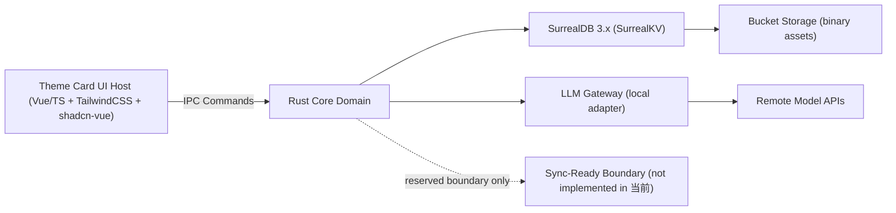

# Mirage Design Boundaries

> Last Updated: 2026-04-05

本文件定义 Mirage 的实现边界。
这些约束默认视为“高重构成本决策”，变更前必须先更新文档并通过专项评审。

## 术语定义

| 术语　　　　　　　　　　  | 定义　　　　　　　　　　　　　　　　　　　　　　　　　　　　　　　　　　　　　　　　　　　　　　　　　　　　　　　　　　　　　　　　　　  |
| ------------------------- | ----------------------------------------------------------------------------------------------------------------------------------------- |
| `Theme Card`　　　　　　  | 核心实体。承载角色设定、共享指令、Prompt 配置等共享数据，类似其他应用中的"角色卡"但不兼容 SillyTavern 格式。每张卡片有独立的 `version`。  |
| `Session`　　　　　　　　 | 会话单元。归属于某张 Theme Card，承载独立的消息历史、检索记忆上下文与会话级临时配置。同卡多 Session 互不串扰。　　　　　　　　　　　　　  |
| `Prompt Preset`　　　　　 | 提示词预设模板。可被 Theme Card 引用，定义系统提示词的结构与参数组合。　　　　　　　　　　　　　　　　　　　　　　　　　　　　　　　　　  |
| `Persona`　　　　　　　　 | 用户人格配置。定义自机角色的性格、语气、背景设定等维度，供 Theme Card 引用。　　　　　　　　　　　　　　　　　　　　　　　　　　　　　　  |
| `Profile`　　　　　　　　 | 保留的工作区容器概念。v1 默认单一且对用户隐藏，不作为会话隔离手段，仅作为未来多工作区扩展的预留维度。　　　　　　　　　　　　　　　　　　 |
| `Theme Card UI Host`　　  | 前端 UI 宿主层。负责渲染、输入、交互编排，不承载核心领域规则。　　　　　　　　　　　　　　　　　　　　　　　　　　　　　　　　　　　　　  |
| `Memory Retrieval Layer`  | 记忆检索层。根据 Session 上下文从存储中检索相关记忆片段，输入必须带 `session_id` 与 `theme_card_id`。　　　　　　　　　　　　　　　　　　 |
| `LLM Gateway`　　　　　　 | LLM 网关适配层。负责本地调用 LLM 提供方 API 并归一化响应，不承接云账号中心与云会话态。　　　　　　　　　　　　　　　　　　　　　　　　　  |
| `App Config`              | 应用级配置实体。与 Theme Card 分离，通过 `ResourceCrudCommand` 读写。非敏感配置存 SurrealDB，敏感配置走加密存储。作为单一逻辑实体管理。   |

### 决策关键术语

以下术语出现在约束条件和决策分支中，需要精确定义以避免歧义。

| 术语           | 定义                                                                                                                                                                                                    | 正例                                                                                   | 反例                                                                                                                             | 引用约束                |
| -------------- | ------------------------------------------------------------------------------------------------------------------------------------------------------------------------------------------------------- | -------------------------------------------------------------------------------------- | -------------------------------------------------------------------------------------------------------------------------------- | ----------------------- |
| 破坏性字段变更 | 对已持久化 struct 的字段做出**会导致旧数据无法被新代码正确反序列化**的改动。包括：删除字段、重命名字段、改变字段类型、将 optional 改为 required（无默认值时）。                                         | 将 `description` 从 `String` 改为 `Vec<String>`；删除已有字段                          | 新增 optional 字段（旧数据缺失时有默认值）；仅修改字段的业务校验规则而不改类型                                                   | MH-03, COMPATIBILITY.md |
| 领域规则       | 由 Rust `domain/` 层定义并执行的业务判定逻辑——即**决定操作是否被允许、数据是否有效、状态如何流转**的规则。                                                                                              | 实体唯一性校验、schemaVersion 兼容性判定、Session 归属权校验、ThemeCard 生命周期状态机 | 前端输入格式提示（如"不少于 3 个字符"的 UI 即时反馈）；纯展示逻辑（如排序、过滤、分页）                                          | MH-19, HR-07            |
| 敏感输入       | 用于**安全校验**的载荷：其值的正确性直接关联安全硬拒绝路径（HR-01/02/03）。与 OPERATIONS.md 的"日志脱敏"范围不同——日志脱敏覆盖所有不可公开数据，敏感输入仅指需 Rust `validator` 校验的安全类入参。      | 设备配对参数、用户口令、签名载荷                                                       | API Key（属日志脱敏范围但不走 `validator` 安全校验，走加密存储）；ThemeCard 名称（普通业务字段，`validator` 校验归 DomainError） | MH-08, OPERATIONS.md    |
| 高返工成本边界 | 一旦落地后修改需要**跨多文件/多层同步变更**的公开面。具体枚举：IPC 命令签名、RuntimeEvent 载荷结构、错误码语义、持久化 schema、迁移策略、安全硬拒绝路径。判定标准：如果改动只影响单文件内部实现则不算。 | 修改 `create_theme_card` 的返回类型；变更错误码的 `retryable` 语义                     | 重构 `domain/` 内部辅助函数；调整 UI 组件布局；修改非公开的 Rust 内部 struct                                                     | PLANS.md, HARNESS.md    |

## 系统边界



## 不可漂移职责

- `Theme Card UI Host` 负责渲染、输入、交互编排、事件展示。
- `Theme Card UI Host` 不实现核心领域规则，不绕过领域命令写关键对象（HR-07）。
- `Theme Card UI Host` 的 UI 技术基线由 `docs/FRONTEND.md` 定义；当前默认 `TailwindCSS + shadcn-vue`，偏离需专项说明并评审。
- Rust Core Domain 负责 `Theme Card` 生命周期、检索层、会话状态机与安全能力。
- Rust Core Domain 是业务规则与持久化行为的唯一权威执行层。
- `Theme Card` 承载共享设定，不直接承载会话态记忆。
- `Session` 承载独立会话上下文与记忆空间，同一卡片下多个 Session 必须互不串扰。

## 数据作用域模型

- 默认模型为 `单用户单工作区 + 同 Theme Card 下多 Session`。
- `Theme Card` 级设定在该卡片全部 Session 之间共享。
- 检索上下文、会话消息、会话注入状态归属 `Session` 作用域。
- `Profile` 仅作为未来可选工作区容器保留，当前默认单一且对用户隐藏，不作为会话隔离手段。

## 模块实现约束

- `ThemeCard` 必须版本化，`schemaVersion` 必填（MH-02）。
- `ThemeCard` 生命周期状态：当前仅 `Active` / `Deleted` 两态，扩展需评审。
- 破坏性字段变更必须附带迁移函数，禁止静默破坏旧数据。
- `Memory Retrieval Layer` 输入必须至少带 `session_id` 与 `theme_card_id`；检索失败必须可展示，不得直接崩溃（MH-09）。
- `LLM Gateway` 只做本地适配与归一化，不承接云账号中心与云会话态。
- `SyncTransport`、`SyncOperationLog`、`ConflictResolver` 在当前仅作为保留接口，不可引入可执行同步流程（HR-04）。

## IPC 与类型契约

- Rust 类型系统是跨边界契约真源（MH-01）。
- 跨 IPC 的 Rust struct 统一使用 `#[serde(rename_all = "camelCase")]`，保持前端消费侧字段命名一致性。
- `Specta` 仅用于导出前端消费类型。
- TypeScript 边界手写 `Zod` schema，使用 `z.ZodType<T>` 或等价约束保证类型对齐（MH-07）。
- 敏感输入必须在 Rust 侧叠加 `validator` 校验作为第二道边界（MH-08）。

### IPC 分层（MH-14）

- `UseCaseCommand`：核心业务动作命令。
- `ResourceCrudCommand`：配置与轻量资源读写，不得绕过领域规则。
- `RuntimeEvent`：状态、进度、日志、告警与可恢复提示。

### UseCase 最小集合（MH-15）

- `create_theme_card` / `update_theme_card`
- `create_session` / `switch_session`
- `run_memory_retrieval`
- `invoke_llm_generation`

### 稳定接口名（MH-16）

- `LLMGatewayProvider`
- `MemoryRetrievalLayer`
- `SyncOperationLog`（reserved）
- `ConflictResolver`（reserved）
- `SyncTransport`（reserved）

## IPC 通信模式

### 类型流转管线

```
Rust struct (真源) → Specta 生成 TS 类型声明 → 手写 Zod schema (satisfies z.ZodType<T>) → IPC 消费点运行时校验
```

### 流式生成（Tauri Channel API）

- 前端 `invoke` 时传入 Tauri Channel。
- Rust `command/` 层接收 Channel，委托 `gateway/` 层发起 LLM 请求。
- `gateway/` 通过 reqwest 流式读取远端响应，经 `channel.send()` 逐块推送 token。
- Channel 事件类型：`TokenChunk`（增量文本）、`Completion`（生成完成）、`Error`（生成错误）。
- 此模式仅用于 `invoke_llm_generation`；其他命令使用标准请求-响应。

### 全局通知（Tauri Event System）

- Rust 通过 `app_handle.emit(event_name, payload)` 广播 RuntimeEvent。
- 前端通过 `listen(event_name, callback)` 消费，须在组件生命周期内管理注册与注销。
- 用途：`AppReady`（启动序列步骤 5）、后台进度、状态变更、系统告警。
- 单向广播语义，不用于请求-响应模式。

## Rust 架构分层

Rust 侧采用领域分层架构，按职责划分为四层：

### `domain/` — 核心业务层

纯业务逻辑：实体定义、值对象、领域服务、Repository trait 定义。
无框架依赖（不依赖 Tauri、SurrealDB 等），无外向依赖。

### `infra/` — 基础设施层

基础设施实现：SurrealDB 嵌入式适配器、文件系统操作、Vault 加密存储（ring + argon2）。
实现 `domain/` 定义的 Repository trait。

### `gateway/` — 外部适配层

外部服务适配器：通过 reqwest 调用 LLM 提供方 API、响应归一化。
实现 `domain/` 定义的 `LLMGatewayProvider` trait。

### `command/` — 命令处理层

Tauri `#[tauri::command]` 处理器。薄编排层：反序列化输入、委托领域/基础设施/网关层执行、序列化输出。
拥有 per-entity mutex 实现同一实体变更命令串行化（MH-23）。

### 依赖规则

```
command/ → domain/, infra/, gateway/
infra/   → domain/
gateway/ → domain/
domain/  → (无外部依赖)
```

## Rust 编码约定

### derive 顺序

按字母排列，`serde` 属性紧随 derive 之后：

```rust
#[derive(Clone, Debug, Deserialize, Serialize, Type)]
#[serde(rename_all = "camelCase")]
pub struct Example { ... }
```

### 可见性规则

- `domain/` 层实体、值对象、trait：`pub`（供 infra/gateway/command 引用）。
- 层内辅助函数与实现细节：`pub(crate)` 或私有。
- `command/` 层的 `#[tauri::command]` 函数：`pub`（Tauri 框架要求）。

### async trait

- 使用 Rust 原生 async trait（Rust 1.75+ 稳定），不引入 `async-trait` crate。
- Repository trait 方法可直接声明为 `async fn`。

### 错误层间传递

- 各层在自己的边界定义 `thiserror` enum（如 `DomainError`、`InfraError`）。
- 层间通过 `impl From<XxxError> for YyyError` 转换。
- `anyhow` 仅在层内部传播不需要完整类型化的中间环节，不跨层暴露。

## 错误分类

所有跨 IPC 错误必须归入以下四类之一（MH-22），每个错误携带 `error_code` 字符串标识与可选 `retryable` 标志：

- `DomainError`：校验失败、迁移失败、实体未找到、版本不匹配等用户可干预错误。
- `InfraError`：存储读写失败、资产写入失败、悬挂引用等基础设施错误。
- `SecurityError`：未配对设备、口令错误、签名校验失败——全部硬拒绝，不可降级。
- `GatewayError`：模型提供方失败（含 `retryable`）、归一化失败（内部错误，不透出供应商原始结构）、检索降级。

错误码在 Rust 与 TypeScript 两侧手动维护，保持一一对应（TD-01 约束）。

### 错误分类决策树

遇到新错误场景时，按以下顺序判定分类：

```
1. 是否涉及安全边界？（口令、密钥、签名、配对、权限）
   → 是 → SecurityError（硬拒绝，retryable: false）

2. 是否来自外部服务响应？（LLM 提供方、远端 API）
   → 是 → GatewayError
       ├─ 提供方可达但返回错误 → retryable: true
       └─ 归一化/解析失败 → retryable: false（内部错误）

3. 是否来自基础设施层？（SurrealDB、文件系统、Vault 存储、资产 bucket）
   → 是 → InfraError
       ├─ 存储读写超时/连接失败 → retryable: true
       └─ 数据损坏/悬挂引用/迁移执行失败 → retryable: false

4. 以上都不是 → DomainError（业务规则层）
       ├─ 校验失败/实体未找到/版本不匹配 → retryable: false
       └─ 用户主动取消 → retryable: false（不计入失败统计）
```

#### 边界案例判定

| 场景                                      | 分类            | 理由                                     |
| ----------------------------------------- | --------------- | ---------------------------------------- |
| SurrealDB 查询返回格式异常                | `InfraError`    | 存储层返回的数据不符预期，属基础设施故障 |
| 迁移函数执行失败（schema 不兼容）         | `InfraError`    | 迁移在 infra 层执行，即使逻辑源自 domain |
| 迁移函数校验发现字段缺失（数据问题）      | `DomainError`   | 数据本身不满足业务约束                   |
| LLM 返回空响应                            | `GatewayError`  | 外部服务行为异常，归一化层负责           |
| Zod schema 校验失败（前端侧）             | 不跨 IPC        | 前端本地处理，不进入 Rust 错误分类       |
| Rust `validator` 校验失败（敏感输入）     | `SecurityError` | 敏感载荷入口校验归安全类                 |
| Rust `validator` 校验失败（普通业务字段） | `DomainError`   | 非安全相关的业务校验                     |

### 错误处理实现

- `thiserror`：在每层边界定义 typed error enum（`DomainError`、`InfraError`、`GatewayError`、`SecurityError`）。
- `anyhow`：在层内部传播错误，用于无需完整类型化的中间环节。
- 转换链：各层 thiserror enum → `command/` 层统一映射为结构化 IPC 错误响应（含 `error_code` + `retryable`）。

## IPC 并发模型

- 对同一实体（同一 `theme_card_id` 或 `session_id`）的变更命令必须串行化执行（per-entity mutex）。
- 只读查询可并发。
- 串行化职责在 Rust 命令处理层，前端不承担排队逻辑。

## 可观测性约束

- Rust 侧使用 `tracing` + `tracing-subscriber`：`tracing` 提供结构化 span/event API，`tracing-subscriber` 负责输出目标配置与分层过滤。
- 结构化字段至少包含：command name、entity IDs、duration、error code。
- 前端日志通过轻量 wrapper 输出到控制台。
- `RuntimeEvent` 通道可承载开发者级日志事件。

## 应用级配置

- 应用配置由 Rust Core Domain 管理，与 `Theme Card` 分离。
- 非敏感配置存入 `SurrealDB`。
- 敏感配置（API Key 等）走加密文件，遵循 `SECURITY.md` 加密存储规则。
- 通过 `ResourceCrudCommand` 暴露读写接口。

## 文件系统布局

- SurrealDB 数据目录：`{app_data_dir}/db/`
- 加密存储目录：`{app_data_dir}/vault/`
- 路径解析统一使用 Tauri `app_data_dir()` API，不硬编码平台路径。

## 启动序列

1. Tauri Builder 初始化。
2. SurrealDB 连接 + 应用级迁移检查。
3. Vault 初始化（检查是否存在，按需提示口令）。
4. 注册 IPC 命令。
5. 发出 `AppReady` RuntimeEvent。

在步骤 5 完成前，前端应展示加载态，不发送业务命令。

> **本节是 `AppReady` 的权威定义**。后端门禁行为（`APP_NOT_READY` 错误）见 `HARNESS.md` 命令执行语义章节；事件注册详情见 `COMPATIBILITY.md` RuntimeEvent 注册表；前端 loading 状态约束见 `FRONTEND.md`。

## 性能预算（参考值）

- 非 LLM 命令 IPC 往返 < 100ms。
- LLM 生成延迟取决于提供方，不设固定预算。
- 启动到 `AppReady` < 3s（参考硬件基准，后续可调）。

## 当前 非目标边界

- 不建设云端中转 `LLM Gateway` 服务（HR-08）。
- 不引入云账号中心与云托管同步（HR-09）。
- 不承诺 SillyTavern 角色卡格式兼容。
- 不建设插件/扩展系统。
- 不做国际化（i18n），但错误使用 error code 而非硬编码字符串。
